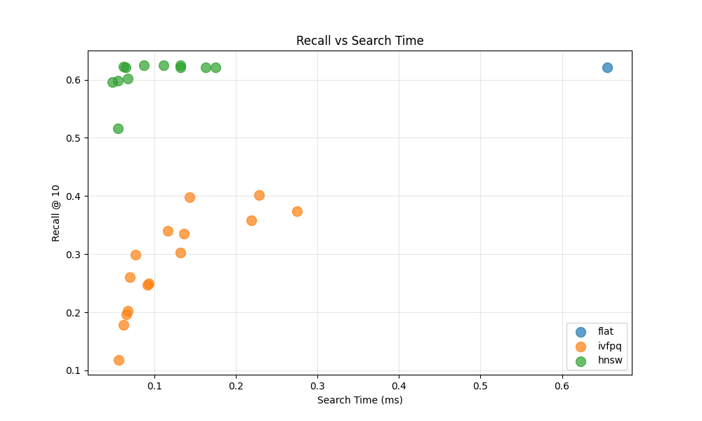
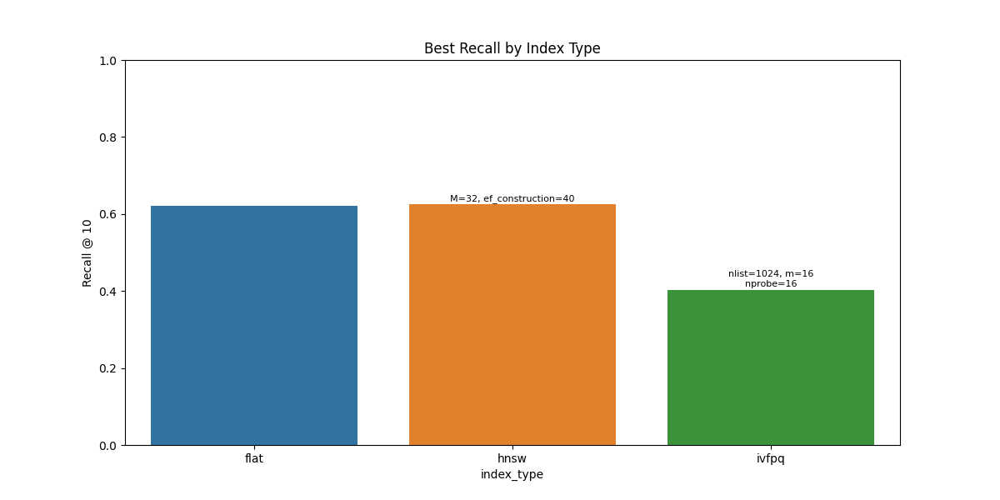
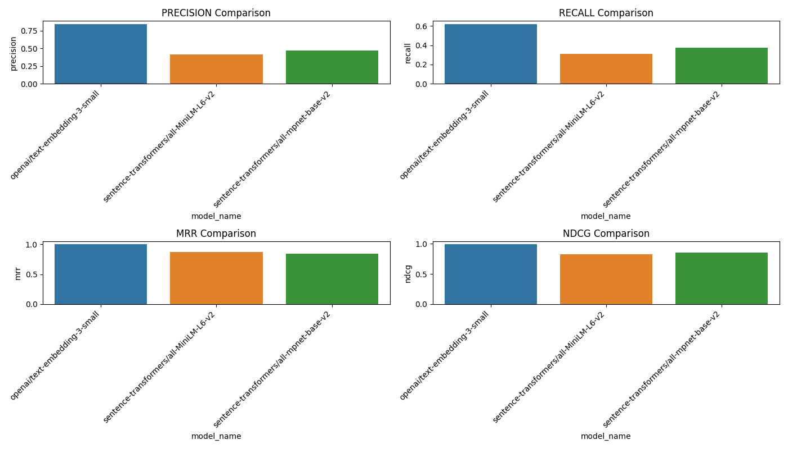
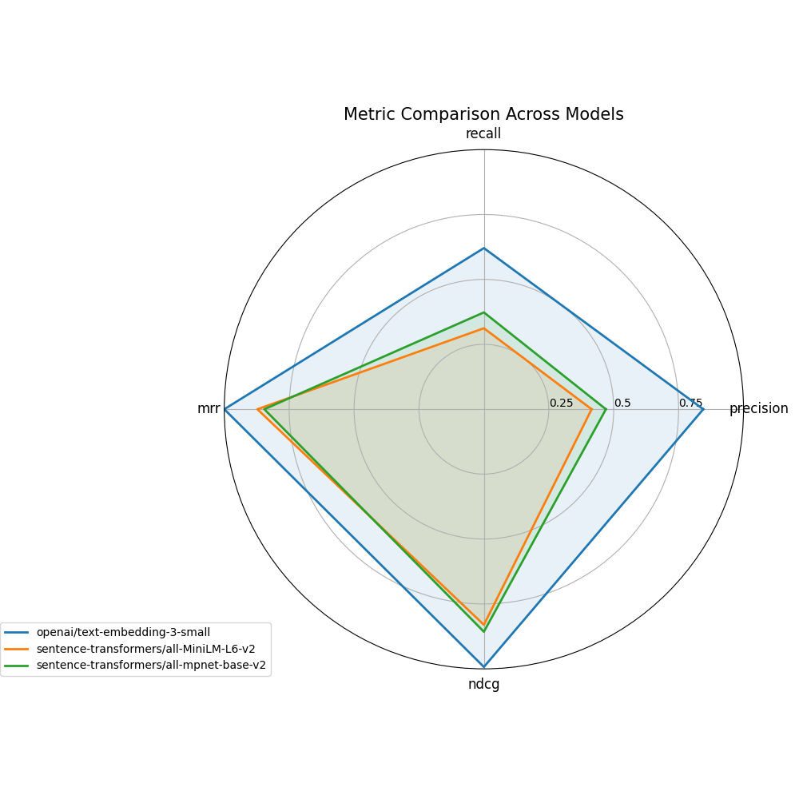

# GiftFindr

GiftFindr is a full-stack prototype that turns natural-language gift queries into personalized recommendations. It offers a React-based frontend chat interface, a Flask/Python backend with FAISS vector search, and supporting scripts for tuning and evaluation.

---

## Repository Structure

```
├── frontend/ # React app (Vite + TailwindCSS)
├── backend/ # Python API, FAISS index, labeling tool
├── scripts/ # Utilities for FAISS tuning & embedding comparison
└── README.md # This file
```

---

## Frontend

Navigate into the `frontend/` folder:

```bash
cd frontend
npm install
npm run dev
```

• Starts a local dev server (usually at http://localhost:5173).
• Entry point: src/main.jsx → renders App.jsx.
• Main chat UI: src/components/ChatBot/Chat.jsx.
• Product list markdown renderer: src/components/Products/Products.jsx.

---

## Backend

See backend/README.md for full details. In short:

```bash
cd backend
pip install -r requirements.txt
# generate or use existing FAISS index:
python src/build_index.py --backend openai --model text-embedding-3-small
# start API server:
python src/server.py
```

API endpoints:

/api/chatbot: handles user–assistant conversation
/api/chatbot/json: returns structured query data
/api/search: returns product recommendations

## Scripts

From project root, run scripts in `scripts/`:

tune_faiss_params.py: grid-search best FAISS params (IVF-PQ, HNSW)
compare_embeddings.py: compare embedding backends/models (OpenAI vs. Sentence-Transformers)
Each script writes results and plots under `backend/output/....`

## Quick Run

1. Start backend server
2. Start frontend dev server
3. Chat in browser and get gift suggestions!

---

## Visualization & Results

Our tuning and comparison scripts under `scripts/` produce several plots (saved in `backend/output/.../plots/`). Below are highlights illustrating why we chose our final configuration and model.

### FAISS Parameter Tuning

  
Scatter plot of recall@10 vs. search time across index types and parameters. We see that the exact (flat) index maximizes recall but at higher query latency.

  
Bar chart comparing the top recall for each index family. HNSW balances recall and speed, while IVF-PQ offers smaller index size at the cost of lower recall.

### Embedding Model Comparison

  
Bar plot of precision, recall, MRR, and nDCG@10 for each embedding model. OpenAI’s `text-embedding-3-small` leads on NDCG and precision.

  
Radar chart summarizing all metrics. The chosen model (`openai/text-embedding-3-small`) shows consistently high scores across the board.

**Chosen Configuration**

- Index type: **flat** (exact search)
- Embedding model: **openai/text-embedding-3-small**

This combination achieves top NDCG@10 (~0.99) and precision while keeping query time reasonable.

For full backend instructions, detailed tuning steps, and more visualizations, see [backend/README.md](backend/README.md).
